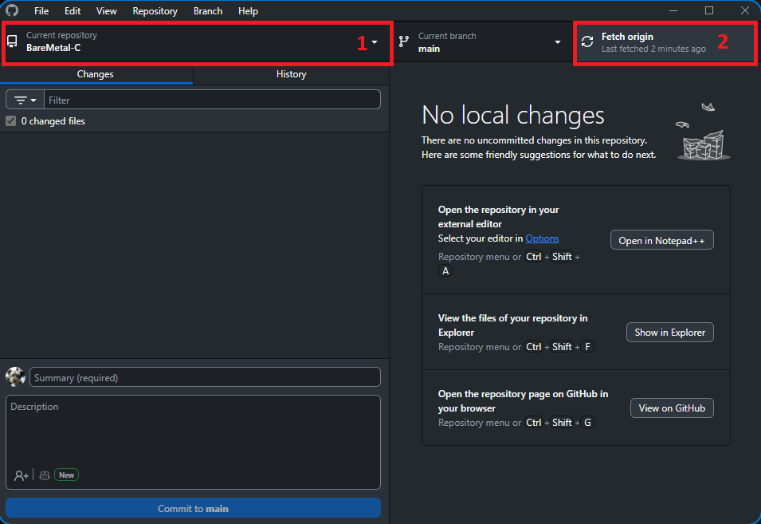

# How to regularly update the course material

As the course progresses, more and more material will be added to this repository. You need to regularly update 2 things manually to keep up with the latest lectures, bug fixes, etc.

## 1. Update course repository using `GitHub Desktop`

**works for both macOS and Windows:**

- Start `GitHub Desktop` app. Make sure you are at `BareMetal-C` repository (1), then click `fetch` (2).

  

- If there's any update, there will be an option to do a *pull*. Click `pull`.

  

- The course material will be updated to the latest version as of the time of update.

## 2. Update Docker Images

**Windows:**

- Open `PowerShell`. Copy and paste the following:

  ```powershell
  docker images --format "{{.Repository}}:{{.Tag}}" | Where-Object { $_ -notlike "*<none>*" } | ForEach-Object { docker pull $_ }; docker image prune -f
  ```

- Wait for the command to finish and you get the prompt back. You will get the following message:

  > `Total reclaimed space: ...`

**macOS:**

- Open `Terminal`. Copy and paste the following:

  ```zsh
  docker images --format "{{.Repository}}:{{.Tag}}" | grep -v "<none>" | xargs -L1 docker pull && docker image prune -f
  ```

- Wait for the command to finish and you get the prompt back.You will get the following message:

  > `Total reclaimed space: ...`

---

Go back to [home page](../README.md)
